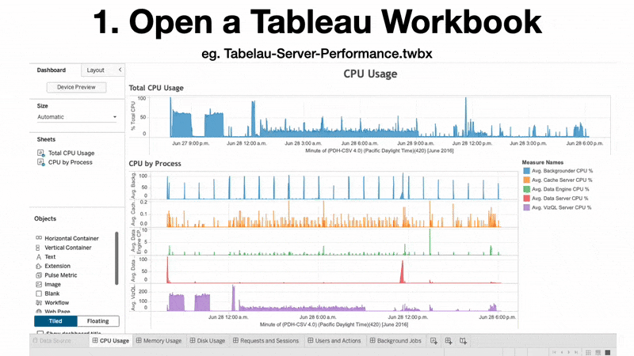

# document-api-python (Fork)
A maintained, backward-compatible fork of Tableau’s Document API with structured workbook objects, complete metadata extraction, and an integrated diff engine.


<p align="center">
  
</p>

<p align="center">
  
  
  
</p>


## About This Fork

This repository is a maintained fork of Tableau's [document-api-python](https://github.com/tableau/document-api-python).

**The core feature of this fork is to enable programmatic comparison of Tableau workbooks**, implemented through structured extraction of workbook metadata to enable programmatic comparison of changes affecting reported values.

If you are looking for the official Tableau Document API, see the [upstream project](https://github.com/tableau/document-api-python).

## What's New in This Fork (v0.12)
Version 0.12 introduces several optional, backward-compatible enhancements:

- **Workbook comparison** — Compare two workbook versions using `Query.compare_workbooks()`
- **Comprehensive metadata extraction** — Generate a unified metadata table with `get_workbook_metadata_table()`
- **MCP integration** — AI-powered workbook comparison via Model Context Protocol
- **Dashboard & worksheet objects** — Structured access to child elements and usage metadata  
- **Datasource dependency parsing** — Distinguishes field definitions from dependency instances.  
- **Filter parsing** — Access to filter classes, groupfilters, and hierarchical filter structures.  
- **High-level query interface** — `workbook.query` for cross-workbook analysis and dependency mapping
- **Parameter parsing** — Additional Field attributes (`value`, `param_domain_type`, `members`)
- **XML string input** — Create workbooks directly from raw TWB XML, enabling integration with the [Tableau Server REST API](https://help.tableau.com/current/api/rest_api/en-us/REST/rest_api.htm).  
- **Command-line tool** — Minimal `twb-diff` CLI to compare two workbooks.

Full details and examples are available in  
**[Version 012 Enhancements](Version_012_enhancements.md).**


## Quick Start
### Setup
```bash
## Clone this repo
git clone git@github.com:jbisal/document-api-python.git
## Install package locally in editable mode
pip install -e .
```

### Compare two workbooks (Python)
```python
from tableaudocumentapi.query import Query
df_diff = Query.compare_workbooks(
    wb1_filename="Workbook_v1.twbx",
    wb2_filename="Workbook_v2.twbx"
)
df_diff.to_csv("df_diff.csv", index=False)
```
### Compare two workbooks using the CLI
```bash
twb-diff --wb1 Workbook_v1.twbx \
         --wb2 Workbook_v2.twbx \
         --out df_diff.csv
```
### Compare with MCP Client (e.g., Claude)
```bash
# Add TWB-Diff to claude as a MCP server w stdio transport
claude mcp add --transport stdio TWB-Diff -- \
  $(pwd)/.venv/bin/python \
  -m tableaudocumentapi.mcp_server
# Ask Claude: "Compare these two Tableau workbooks and explain the differences"
```

Installation and additional usage examples are provided in  
**[API Reference](api-ref.md).**

## Documentation
- **API Reference:** [api-ref.md](api-ref.md)  
- **Enhancements & examples:** [Version 012 Enhancements](Version_012_enhancements.md)  
- **Original Tableau API documentation:** https://tableau.github.io/document-api-python/  

## Upstream Issues Resolved
This fork addresses several upstream issues, including:

- [#33 – Datasource Filters](https://github.com/tableau/document-api-python/issues/33)  
- [#138 – Datasource-dependencies columns passed as fields](https://github.com/tableau/document-api-python/issues/138)  
- [#164 – Expose all child objects of Workbook/Worksheet](https://github.com/tableau/document-api-python/issues/164)  
- [#246 – Missing attributes for meta-data records](https://github.com/tableau/document-api-python/issues/246)  
- [#129 – Retrieve all fields used in a workbook](https://github.com/tableau/document-api-python/issues/129)  

For a full explanation, see the “Resolved Upstream Issues” section in [Version 012 Enhancements](Version_012_enhancements.md).

## Original Features
All original capabilities of the Tableau Document API are preserved, including:

- Support for TWB, TWBX, TDE and TDSX files  
- Access to connection information (server, username, database, authentication type, connection type)  
- Updating connection details in workbooks and datasources  
- Extracting field information from datasources and workbooks  


For more information on the original API, see the [Tableau API documentation](https://tableau.github.io/document-api-python).
